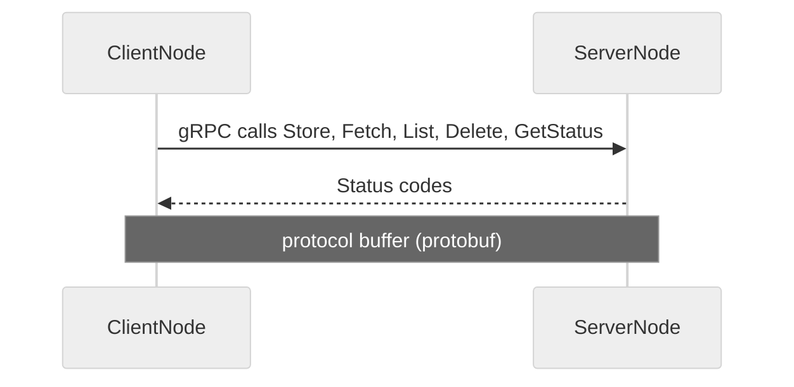
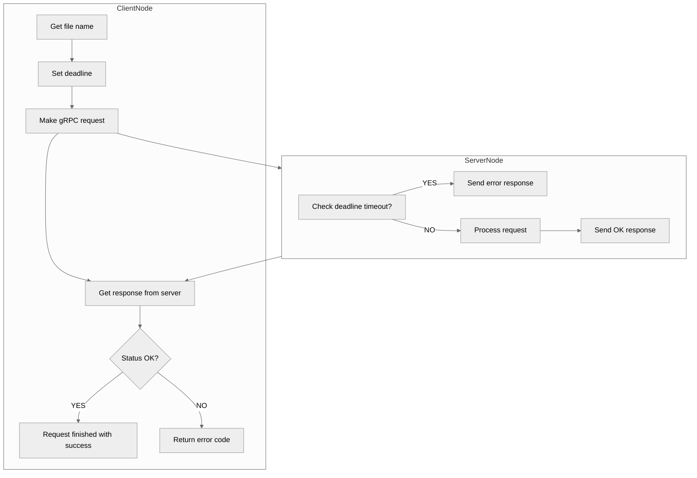

## Summary

This project is expecting us to design and implement a simple distributed file system (DFS) to transfer files between client and server. In part 1, we need to design and implement a google remote procedure call (gRPC) service that could fetch, store, list and get status for files on a remote server. Then in part 2 based on the working gRPC service, we need to further complete the DFS by implementing 1) write lock to avoid racing into the same file and 2) asynchronous gRPC calls that allow the server to communicate to clients whenever there are changes in the directory.

## Part 1
In the part 1, we need to implement gRPC service to complete several functions between client and server. We need to develop appropriate message types in protocol buffer (protobuf) that shared between client and service to make RPC calls. With the protobuf developed, we need to implement functions including store, fetch, list, delete, and getting file attributes. It should be highlighted that all the gRPC calls should implement deadline timeouts and the client should be able to recognize when the server has timed out.

* Fetch a file from a remote server and transfer its contents via gRPC
* Store a file to a remote server and transfer its data via gRPC
* List all files on the remote server:

    * For this design, the server is only required to contain files in a single directory; it is not necessary to manage nested directories.
    * The file listing should include the file name and the modified time (_mtime_) of the file data in seconds from the epoch.

* Get the following attributes for a file on the remote server:

    *  Size
    *  Modified Time
    * Creation Time
* Delete a file from a remote server via gRPC

In short, by implementing functions in client side, the client can make the above gRPC calls to server. And by implementing functions in server side, the server can process the request from client and response properly.

In the part 1, we need to implement gRPC service and message types to conduct functions mentioned above including store, fetch, list, delete and getting file attributes. We are expected to implement the service with gRPC C++ API. The design of part 1 is illustrated below.

The overall flow is showed in the below flowchart. 

## Part 2

Based on the part 1 implementation of synchronous gRPC, we are expected to implememnt asynchronous gRPC for part 2. This asynchronous call can enable the server to notify all connected clients whenever there is a changed made in the service.

There are several critical points to understand in this part. First, the write access of files on server directory should be exclusive. Only one client get write/modify a specific file under the server directory. Second, the client is in charge of asynchronous calls. When there is new file on folder or the same file the server has a newer version (more recent modified time), client should fetch the file from the server. And when the client has a nwer version of the same file on server, the client should store/send the file to update the file on server. It is critical keep in mind that multiple clients should never be allowed to access the same file. Thus the proper implementation of mutex lock is important in part 2.

**Protobuf**

The protocol buffer is very similar to part 1 as they basically have same gRPC calls. But to achieve asynchronous function, we need to implement several other call functions to make the write lock request, to handle callback list etc. Therefore, we will need extra message types and modify several messages based on the case of part 1. These changes include:
* Add new message types for write lock and callback list.
* modify request for Store function since it need to obtain write lock by adding new elements client_id in the request.

**client**

To address synchronization issues, the service call functions in part 2 are similar to those in part 1, but with the addition of a write lock request to protect files when a client needs write access to the server. Along with the five file service methods, a new RPC method must be defined to request a file lock for writing access. The implementations for Store and Delete must be adjusted to call the RequestWriteAccess call to acquire a lock, and to proceed based on whether the lock is successfully obtained. The implementations for List and Stat remain the same as part 1 since they are for reading access only. Although Fetch is also for reading, it requires modification to check if the content already exists on the client and if there is a difference between client and server content. Additionally, it is necessary to ensure synchronized clients and servers so that the content on both remains in sync. This involves several scenarios, including the client seeing a cached file as out of date and fetching it, and the client seeing the cached version as updated and storing it on the server. To achieve this, a file watcher thread and inotify infrastructure are implemented in the start code, allowing each client to send a gRPC request to the server when a file is changed, added, or deleted. Finally, each client will make an asynchronous callback request to the server to request notification of changes that the server is aware of, and the synchronization logic flow follows as P-2 below.

**Server**
Different from part 1, some services in part 2 require a locking mechanism to handle write access. To manage the files and locks, I created a map to keep track of which client is holding a lock for each file. This map is implemented with a mutex to ensure it is protected while being updated. The locking mechanism is implemented using lock_guard, which controls mutex ownership within a scope and releases ownership in the destructor. Store and Delete are adjusted to incorporate this locking mechanism.

Additionally, we must implement ProcessCallback to respond to any CallbackList requests for asynchronous requests, and ProcessQueuedRequests to synchronize processing of queued requests in the queue thread. The request queue is also protected by a mutex to ensure that the request queue accessing is not disrupted.

    

        
    

    Description of the control flow in the gRPC DFS.

## References
- [gRPC C++ Reference](https://grpc.github.io/grpc/cpp/index.html)
- [Protocol Buffers 3 Language Guide](https://developers.google.com/protocol-buffers/docs/proto3)
- [gRPC C++ Examples](https://github.com/grpc/grpc/tree/master/examples/cpp)
- [gRPC C++ Tutorial](https://grpc.io/docs/tutorials/basic/cpp/)
- [Protobuffers Scalar types](https://developers.google.com/protocol-buffers/docs/proto3#scalar)
- [gRPC Status Codes](https://github.com/grpc/grpc/blob/master/doc/statuscodes.md)
- [gRPC Deadline](https://grpc.io/blog/deadlines/)

